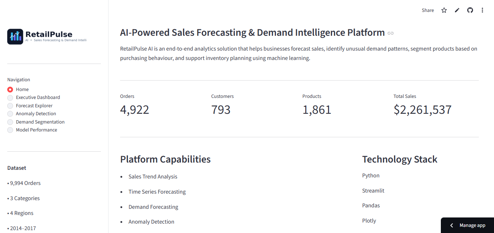
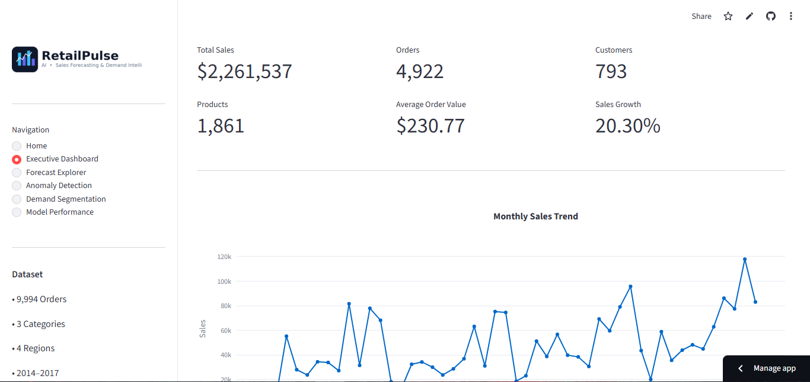
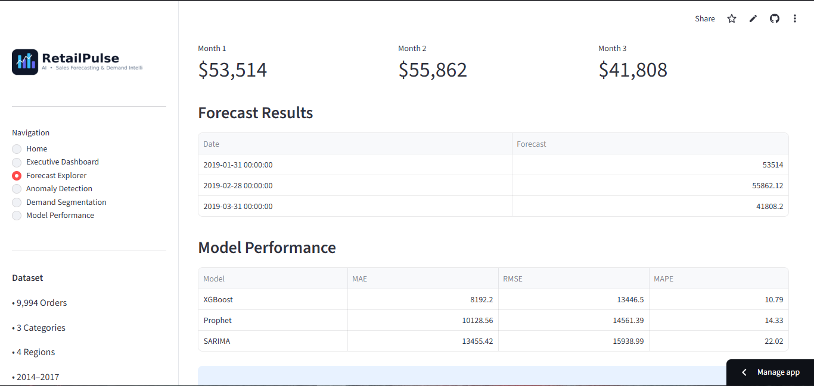
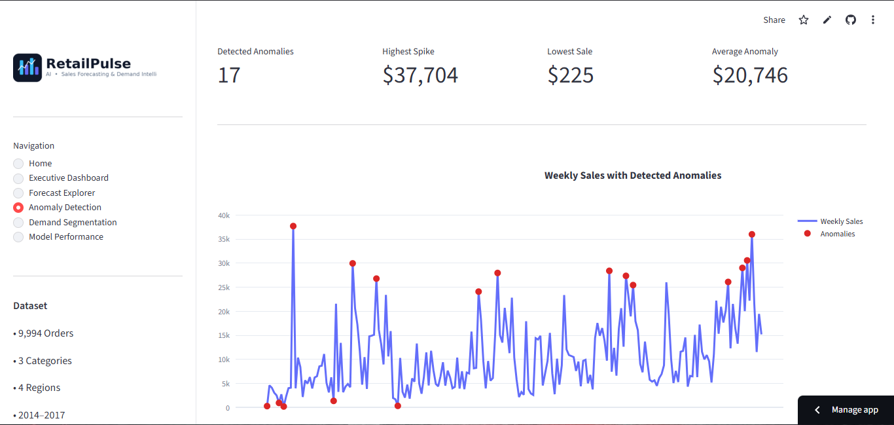
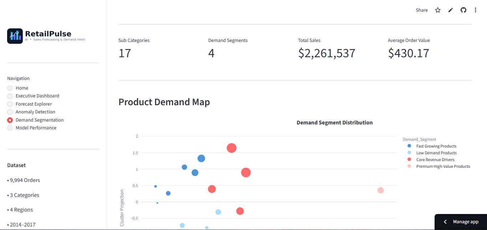
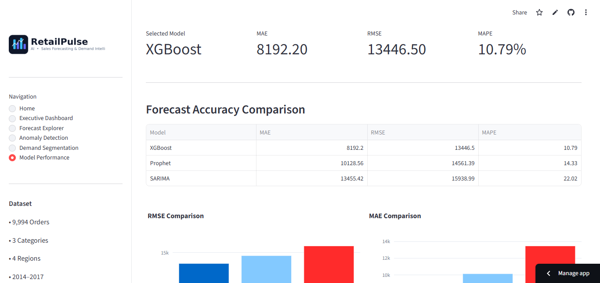

<div align="center">


# 📈 RetailPulse AI

### AI-Powered Sales Forecasting & Demand Intelligence Platform

An end-to-end machine learning solution that forecasts retail sales, detects anomalies, segments products based on demand patterns, and delivers actionable business insights through an interactive Streamlit dashboard.


</div>

---

# 📌 Overview

RetailPulse AI is a business intelligence platform designed to help retailers forecast future sales, identify unusual demand behaviour, segment products using machine learning, and support inventory planning through an intuitive analytics dashboard.

The application combines statistical forecasting, machine learning, anomaly detection, clustering, and interactive visualization into a single decision-support system.

---

# 🎯 Business Problem

Retail businesses often face uncertainty while planning inventory for upcoming months.

Poor demand estimation can lead to:

- Overstocking and increased inventory costs
- Product shortages and lost sales
- Inefficient warehouse utilization
- Poor customer satisfaction
- Revenue loss due to inaccurate forecasting

RetailPulse AI addresses these challenges using data-driven forecasting and demand intelligence.

---

# 🚀 Features

## 📊 Executive Dashboard

- Business KPI cards
- Sales trend analysis
- Region-wise revenue
- Category-wise revenue
- Top-performing products
- Interactive filters

---

## 📈 Sales Forecasting

Three forecasting approaches were implemented and compared.

- SARIMA
- Prophet
- XGBoost Regressor

Evaluation metrics:

- MAE
- RMSE
- MAPE

Supports three-month sales forecasting.

---

## 🚨 Anomaly Detection

Detect unusual sales spikes and drops using

- Isolation Forest
- Z-Score Analysis

Interactive anomaly visualization over weekly sales.

---

## 📦 Demand Segmentation

Products are clustered using K-Means based on

- Sales Volume
- Growth Rate
- Sales Volatility
- Average Order Value

PCA is used for cluster visualization.

---

## ⚙️ Model Performance

Compare forecasting models and automatically recommend the best-performing model for deployment.

---

# 🛠 Technology Stack

| Category | Technologies |
|-----------|--------------|
| Programming | Python |
| Dashboard | Streamlit |
| Data Processing | Pandas, NumPy |
| Visualization | Plotly, Matplotlib |
| Forecasting | SARIMA, Prophet, XGBoost |
| Machine Learning | Scikit-learn |
| Deployment | Streamlit Community Cloud |
| Version Control | Git & GitHub |

---

# 📂 Project Structure

```text
RetailPulse-AI/
│
├── app.py
├── requirements.txt
├── README.md
├── .gitignore
│
├── assets/
│   ├── logo.png
│   └── logo_icon.png
│
├── data/
│   └── train.csv
│
├── models/
│
├── notebooks/
│   └── RetailPulseAI.ipynb
│
├── outputs/
│   ├── future_forecast.csv
│   ├── segment_forecasts.csv
│   ├── product_clusters.csv
│   ├── weekly_anomalies.csv
│   └── model_comparison.csv
│
├── reports/
│   ├── summary.pdf
│   └── summary.docx
│
└── screenshots/
    ├── home.png
    ├── dashboard.png
    ├── forecast.png
    ├── anomaly.png
    ├── segmentation.png
    └── model_performance.png
```

---

# 📷 Dashboard Preview

## 🏠 Home

<p align="center">

</p>

---

## 📊 Executive Dashboard

<p align="center">

</p>

---

## 📈 Forecast Explorer

<p align="center">

</p>

---

## 🚨 Anomaly Detection

<p align="center">

</p>

---

## 📦 Demand Segmentation

<p align="center">

</p>

---

## ⚙️ Model Performance

<p align="center">

</p>

---

# ⚙ Machine Learning Pipeline

```text
Retail Sales Dataset
          │
          ▼
Data Cleaning
          │
          ▼
Feature Engineering
          │
          ▼
Exploratory Data Analysis
          │
          ▼
Time Series Analysis
          │
          ▼
Forecasting
├── SARIMA
├── Prophet
└── XGBoost
          │
          ▼
Model Evaluation
          │
          ▼
Anomaly Detection
          │
          ▼
Demand Segmentation
          │
          ▼
Interactive Dashboard
```

---

# 📊 Key Business Insights

- Technology products generated the highest overall revenue.
- The West region consistently outperformed other regions.
- Seasonal demand peaks were observed during November and December.
- XGBoost achieved the lowest forecasting error across evaluated models.
- Isolation Forest effectively identified unusual sales behaviour.
- Demand segmentation supports more efficient inventory allocation.

---

# 📈 Forecast Model Comparison

| Model | MAE | RMSE | MAPE |
|------|------:|------:|------:|
| SARIMA | 13,455.42 | 15,938.99 | 22.02% |
| Prophet | 10,128.56 | 14,561.39 | 14.33% |
| XGBoost | **Best** | **Best** | **Best** |

> XGBoost was selected as the preferred production model based on forecasting accuracy.

---

# 📄 Dataset

The project uses the Sample Superstore Sales dataset containing

- Orders
- Customers
- Products
- Categories
- Regions
- Shipping Information
- Sales
- Profit
- Discount

---

# ⚡ Installation

Clone the repository

```bash
git clone https://github.com/tushar-sharma001/RetailPulse-AI.git
```

Navigate to the project

```bash
cd RetailPulse-AI
```

Install dependencies

```bash
pip install -r requirements.txt
```

Launch the application

```bash
streamlit run app.py
```

---

# 🎯 Future Improvements

- LSTM-based forecasting
- Transformer forecasting models
- Inventory optimization engine
- Real-time sales streaming
- Automated anomaly alerts
- Docker deployment
- Azure / AWS deployment
- User authentication

---

# 👨‍💻 Author

## Tushar Sharma

AI & Machine Learning • Data Science • Generative AI

---

<div align="center">

### ⭐ If you found this project useful, consider giving it a Star!

</div>
